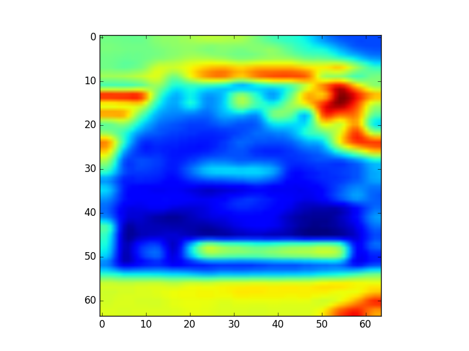
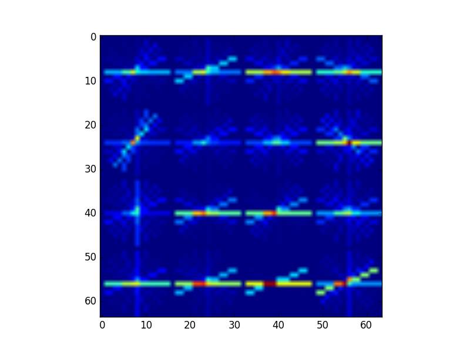
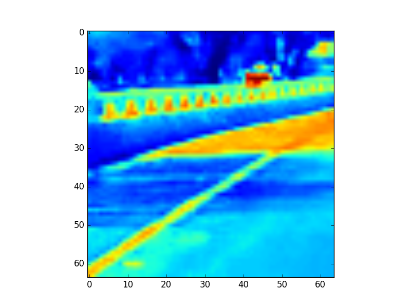
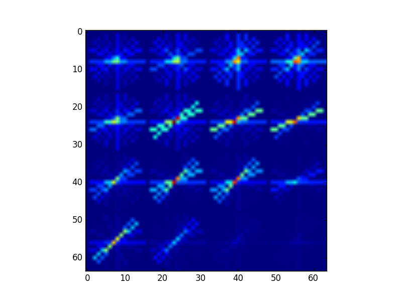
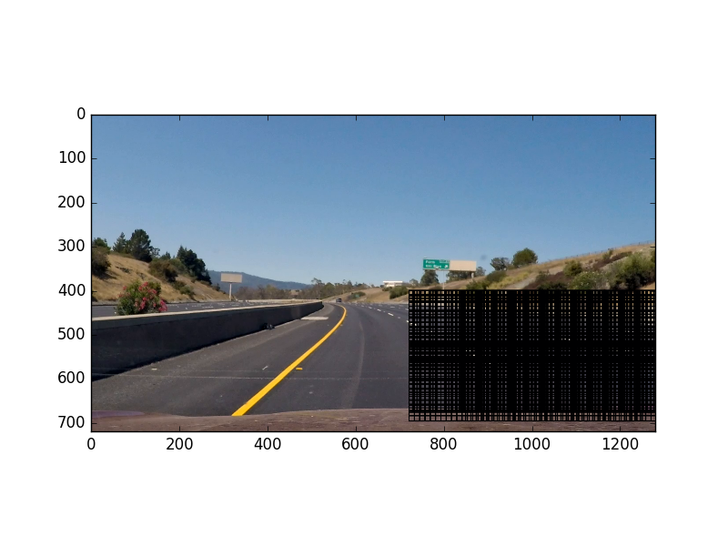
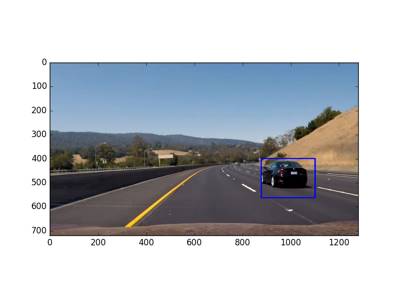

**Vehicle Detection Project**

The goals / steps of this project are the following:

* Perform a Histogram of Oriented Gradients (HOG) feature extraction on a labeled training set of images and train a SVM classifier with rbf kernel
* Implement a sliding-window technique and use trained classifier to search for vehicles in images.
* Run pipeline on a video stream and create a heat map of recurring detections frame by frame to reject outliers and follow detected vehicles.
* Estimate a bounding box for vehicles detected.

[//]: # (Image References)
[image1car]: /train_images/vehicles/GTI_Far/image0045.png
[image1notcar]: /train_images/non-vehicles/Extras/extra40.png
[image3]: ./examples/sliding_windows.jpg
[image4]: ./examples/sliding_window.jpg
[image5]: ./examples/bboxes_and_heat.png
[image6]: ./examples/labels_map.png
[image7]: ./examples/output_bboxes.png
[video1]: ./project_video.mp4

## [Rubric](https://review.udacity.com/#!/rubrics/513/view) Points
###Here I will consider the rubric points individually and describe how I addressed each point in my implementation.  

---
###Writeup / README

####1. Provide a Writeup / README that includes all the rubric points and how you addressed each one.  You can submit your writeup as markdown or pdf.  [Here](https://github.com/udacity/CarND-Vehicle-Detection/blob/master/writeup_template.md) is a template writeup for this project you can use as a guide and a starting point.  

You're reading it!

###Histogram of Oriented Gradients (HOG)

####1. Explain how (and identify where in your code) you extracted HOG features from the training images.

The code for this step is contained in methon extract_features() of the file called `lesson_functions.py`.  

I started by reading in all the `vehicle` and `non-vehicle` images.  Here is an example of one of each of the `vehicle` and `non-vehicle` classes:

![alt text][image1car] ![alt text][image1notcar]

I then explored different color spaces and different `skimage.hog()` parameters (`orientations`, `pixels_per_cell`, and `cells_per_block`).  I grabbed random images from each of the two classes and displayed them to get a feel for what the `skimage.hog()` output looks like.
Here is an example using the `HLS` color space and HOG parameters of `orientations=10`, `pixels_per_cell=(16, 16)` and `cells_per_block=(2, 2)`:
####CAR HLS CHANNEL L

####CAR HOG

####NOT CAR HLS CHANNEL L

####NOT CAR HOG

####2. Explain how you settled on your final choice of HOG parameters.

I tried various combinations of parameters and finally choose the following:  
* color_space = 'HLS'  
* orient = 10  # HOG orientations
* pix_per_cell = 16  # HOG pixels per cell
* cell_per_block = 2  # HOG cells per block
* hog_channel = 1

Also a good result I got for HSV color space channel 2 (V). 

####3. Describe how (and identify where in your code) you trained a classifier using your selected HOG features (and color features if you used them).

I trained a SVM classifier using `RBF kernel` and reach `0.99+` accuracy. I got this result only with HOG features, without histograms and resized images, so I switch off these features. My final features vector length is just `360`.
For linear SVM accuracy around 0.96 but work match faster. 
Code: method `prepare_classifier()` in `search_classify.py`

###Sliding Window Search

####1. Describe how (and identify where in your code) you implemented a sliding window search.  How did you decide what scales to search and how much to overlap windows?

I decided to search window with sizes 96 and 128, y coordinate between 400 and 600, and I start x coordinate from 720 for better performance. The best result I received with overlap = 0.9. It is quite slowing (around 2 hours for the full movie). Other way is to use more windows size (plus 64, for example) but with overlap = 0.7.
Hyperparameters here:
* y_start_stop = [400, 600]  # Min and max in y to search in slide_window()
* x_start_stop = [720, None] # Min and max in x to search in slide_window()
* overlap = 0.9 # overlap fraction (common for x and y)
* sizes_window = [96, 128]

Code: methods `slide_window()` and `search_windows()` in `lesson funtions.py`

####2. Show some examples of test images to demonstrate how your pipeline is working.  What did you do to optimize the performance of your classifier?

Ultimately I searched on two windows sizes using HLS L-channel HOG features without spatially binned color and histograms of color in the feature vector, which provided a nice result. To optimize perfomance I limit `y` and `x` coordinates. 

Here are some example images:

![alt text][image4]
---

### Video Implementation

####1. Provide a link to your final video output.  Your pipeline should perform reasonably well on the entire project video (somewhat wobbly or unstable bounding boxes are ok as long as you are identifying the vehicles most of the time with minimal false positives.)
Here's a [link to my video result](./output_images/project_video_result.mp4)

####2. Describe how (and identify where in your code) you implemented some kind of filter for false positives and some method for combining overlapping bounding boxes.

I recorded the positions of positive detections in each frame of the video. From the positive detections, I created a heatmap and then thresholded that map to identify vehicle positions. I then used scipy.ndimage.measurements.label() to identify individual blobs in the heatmap. I then assumed each blob corresponded to a vehicle. I constructed bounding boxes to cover the area of each blob detected. For smoothing, I take heatmaps for last n frames. My hyperparameters here:
My hyperparameters here:
* heat_depth = 6 # smoothing heatmap by heatmaps stack
* heat_threshold = 5 # final threshold = heat_depth*heat_threshold

Code: methods `process_image()` in `search_classify.py`. As additional trick I limit minimum size of result windows to (30, 30)

Here's an example result showing the heatmap from a series of frames of video, the result of `scipy.ndimage.measurements.label()` and the bounding boxes then overlaid on the last frame of video:

### Here are six frames and their corresponding heatmaps:

![alt text][image5]

### Here is the output of `scipy.ndimage.measurements.label()` on the integrated heatmap from all six frames:
![alt text][image6]

### Here the resulting bounding boxes are drawn onto one of the frame in the series:

---

###Discussion

####1. Briefly discuss any problems / issues you faced in your implementation of this project.  Where will your pipeline likely fail?  What could you do to make it more robust?

The biggest problem is following: for the better result we need overlap equals 0.9+, but in this case, performance goes down. To avoid it I use  tricks:
* only two windows size: 96 and 128
* only HOG features
* limit x and y coordinate

Second problem it false positive despite on heatmap threshold. To resolve I stack last six heatmaps, and apply threshold filter to the sum of them.  

For further improvement I suggest using different windows size in different part of frame: maximum size in bottom part and minimum on the top.   
